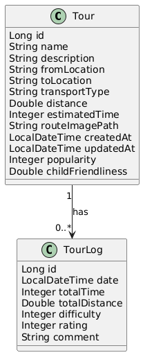
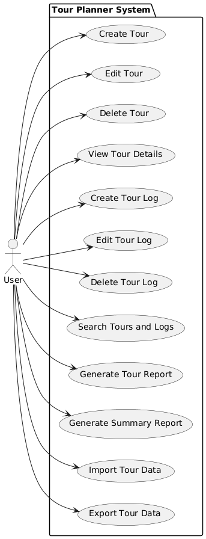
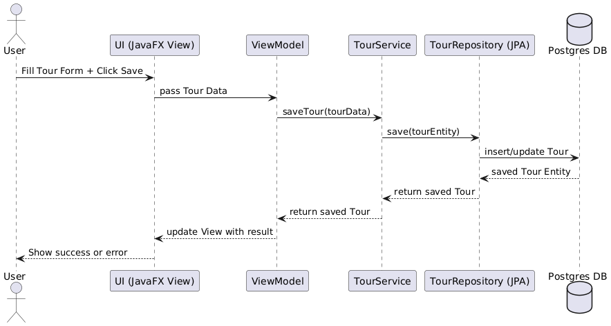

# Tour Planner Project Final Protocol

## 1. Introduction

The Tour Planner project is a Java-based desktop application built with JavaFX, following the MVVM (Model-View-ViewModel) architectural pattern. It offers full tour management, including planning, logging, route calculation, and reporting. The backend is implemented using Spring Boot, with a layered architecture (UI, Business Logic, Data Access) and uses a PostgreSQL database with JPA/Hibernate as the ORM layer.

This is the documentation to meet all criteria defined in the final exam checklist and describes the architecture, features, implementation details, libraries used, and project decisions.

---

## 2. System Architecture

The system is structured into clear layers:

* **UI Layer (JavaFX)**: FXML-based markup, JavaFX controllers, and view models (MVVM) handling data binding and event handling.
* **Business Logic Layer (Spring Boot services)**: Contains service classes handling application logic, calling APIs, calculating values, and coordinating data access.
* **Data Access Layer (Spring Data JPA)**: Repository interfaces for accessing the PostgreSQL database using Hibernate ORM.

### Diagram Overview


<table>
<tr>
<td>

Class Diagram:<br>


</td>
<td>

Use-Case:<br>


</td>
</tr>
</table>


```Sequence Diagram:```  



All configuration values (e.g., database connection) are stored in `application.properties`. No hardcoded values or credentials are used.

---

## 3. Libraries and Technologies

| Purpose              | Library/Technology               |
| -------------------- | -------------------------------- |
| UI Framework         | JavaFX with FXML                 |
| Architecture Pattern | MVVM                             |
| Backend Framework    | Spring Boot                      |
| Database             | PostgreSQL + H2 (for tests)      |
| ORM                  | Hibernate (via Spring Data JPA)  |
| HTTP API Integration | OpenRouteService + OpenStreetMap |
| Logging              | log4j2                           |
| Report Generation    | iText (PDF generation)           |
| Testing              | JUnit, MockMvc, Mockito          |

---

## 4. Features Implemented

Create/modify/delete tours (with required attributes and computed fields)
Display tours in a list view with all details and route map
Validate user input and prevent crashes on bad input
Create/modify/delete tour logs linked to specific tours
Full-text search across tours, logs, and computed attributes
Generate detailed PDF reports for single tours (with maps)
Generate summary reports for aggregated data
Import/export tour data in supported formats
Integrate unique feature: **Live Route Calculation** via OpenRouteService API

---

## 5. Application Architecture Details

* **Layer calls**: Each layer only calls the immediate layer below. The UI never accesses the DAL directly.
* **Exceptions**: Custom exceptions are defined in the business layer; no implementation-specific exceptions leak across layers.
* **API Use**:

    * OpenRouteService Directions API retrieves live route and distance data.
    * OpenStreetMap is used as the tile server for map visualization.
* **Data Storage**: All core data (except static map images) is stored in the PostgreSQL database.
* **Logging**: The system uses log4j2 for structured error, debug, and info logging.
* **Configuration**: All sensitive and configurable properties are stored externally (config files), not hardcoded.

---

## 6. Design Pattern and Decisions

* **Design Pattern**: MVVM is consistently applied on the frontend. Dependency Injection (DI) is used extensively on the backend (via Spring Boot).
* **Why MVVM**: Ensures separation of concerns, makes UI testable, and allows cleaner data binding.
* **Why DI**: Improves testability, decouples components, and adheres to SOLID principles.
* **Unit Testing**: Covers service layer, REST controllers, and utility classes with meaningful tests (over 20 total).

---

## 7. UX and Wireframes

The application wireframes were designed to be intuitive:

* **Resizable layout**: The interface responds to window resizing where appropriate.
* **Reusable components**: Dialogs and input forms are modular.
* **User Flows**: Adding/editing/deleting tours and logs is done through guided dialogs with clear error handling.
* **Map integration**: Dynamic, interactive maps are embedded using Leaflet.js inside JavaFX WebView components.

Wireframes and mockups can be provided separately (see repository screenshots).

---

## 8. Use Cases and Sequence Diagrams

### Main Use Cases:

* Plan and save a tour with computed distance/time
* Add logs to document tour experiences
* Search for tours/logs via full-text search
* Export/import data for backups or sharing
* Generate PDF reports for single tours or overall summaries

Sequence diagrams illustrate the interaction between UI, ViewModel, Service, Repository, and DB components for each use case.

---

## 9. Tracked Time

We tracked project time in the Git commit history and local records (100+hours). Major time blocks were spent on:

* UI development and data binding
* REST integration and backend setup (I started as Monolith and went back to the commit where i had no Backend and created a seperate Backend)
* Testing and validation
* Report generation integration

Git history is available at:
Frontend → [https://github.com/MoSuperCode/Routenplaner](https://github.com/MoSuperCode/Routenplaner)
Backend → [https://github.com/MoSuperCode/RoutenplanerBackend](https://github.com/MoSuperCode/RoutenplanerBackend)

---

## 10. Lessons Learned

* Integrating external APIs (OpenRouteService) requires careful error handling and rate limit awareness.
* JavaFX MVVM design greatly improves maintainability but needs discipline to avoid mixing concerns.
* Spring Boot's layered architecture simplifies complex backend tasks and makes testing easier.
* Report generation with iText has a learning curve but allows powerful PDF exports.
* Designing meaningful unit tests improves confidence and reduces regressions.
* Spring and JavaFX in the SAME Project are really hard to combine (experimental)

---

## 11. Summary

The Tour Planner application fulfills all required project criteria:

* Layered architecture with clear separation
* Full CRUD for tours and logs
* Integrated search, reporting, import/export
* Solid unit testing
* Detailed project documentation and tracked development process

We believe this project provides a robust, scalable, and user-friendly solution for managing tour planning and logging, aligned with all exam requirements.
